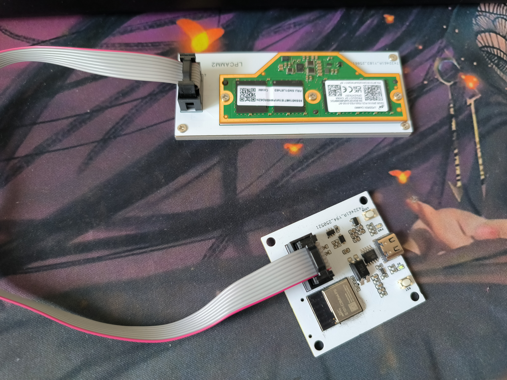
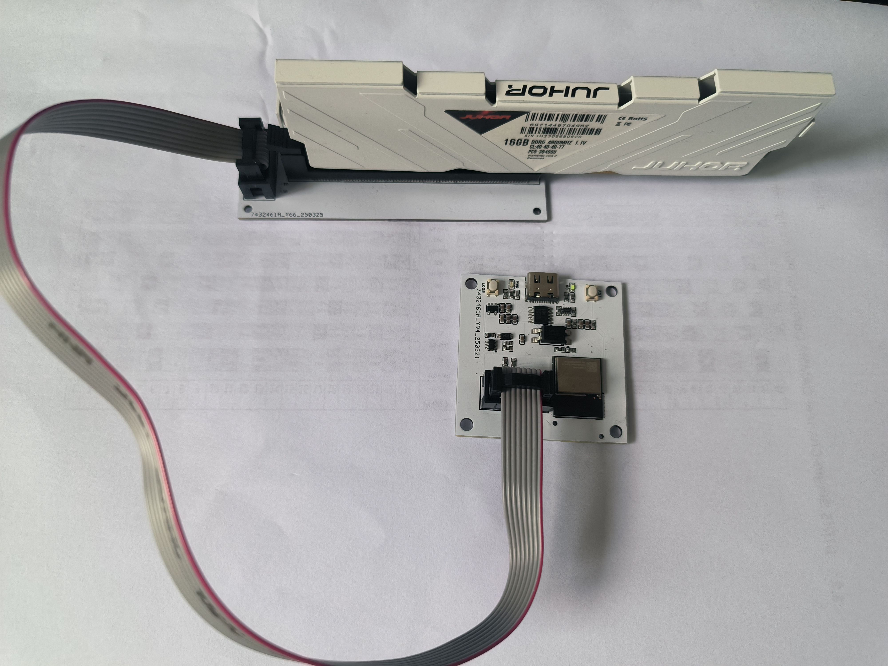
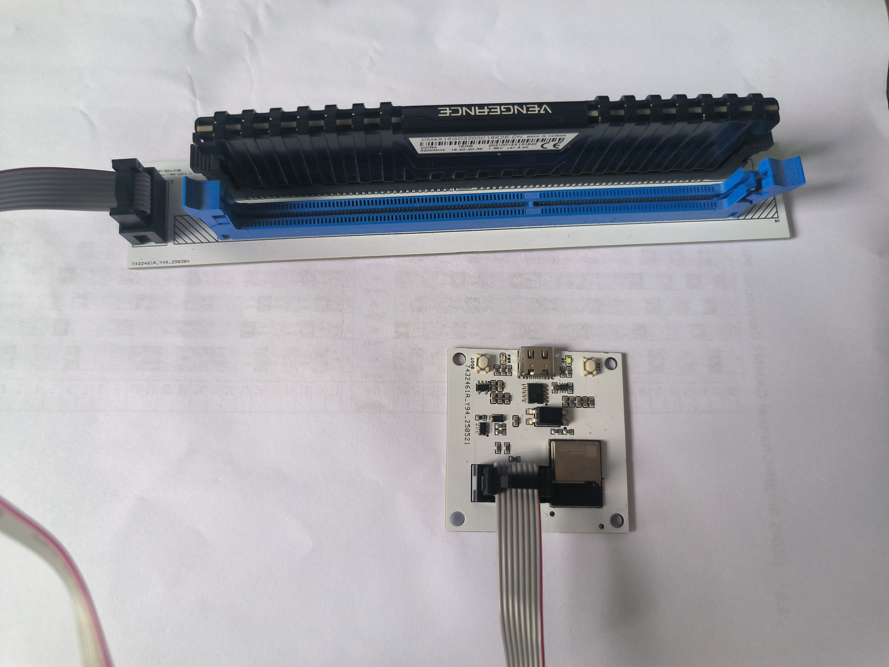

# SPDRW

 - 内存条SPD读写器，支持“设置”“解除”写保护，支持DDR4 DDR5所有类型内存条，自研固件持续更新，完善的串口API接口可自行对接，支持通过浏览器更新固件。

## 实物图片

## 价格

 - 发货时间T+3

|  类型   | 价格(元)  | 单位 |
|  ----  | ----  | ---- |
| 主控板  | 500 | 1PCS |
| DIMM-D34  | 100 | 1PCS |
| DIMM-D5  | 100 | 1PCS |
| LPCAMM2  | 1000 | 1PCS |

## 软硬件定制开发

 - 多DIMM读写、多DIMM设置写保护、多DIMM解除写保护、多DIMM自定义写入、多DIMM自定义读取

## 售后

 1. 7天无理由退货，拆开包装不支持
 2. 180天质量问题只换不修
 3. 质量问题保修一年
 4. 过保有偿维修，无法维修的可提供5折换新
 5. 保内包运费，保外自邮

## 联系：
 - Email: hu1032529794@163.com
 - QQ: 1032529794
 - WX: hu1032529794
 
