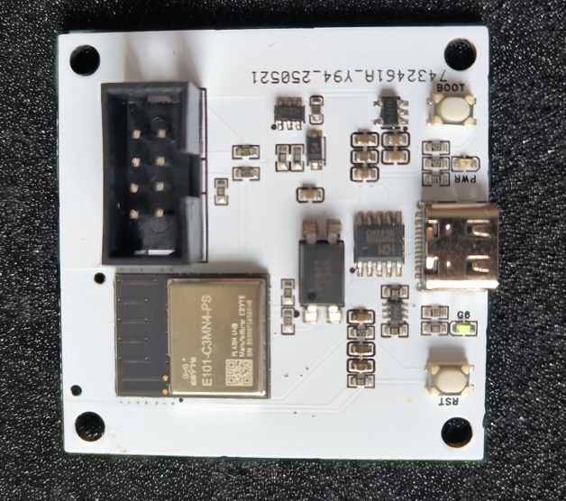

# SPDRW
- 内存条SPD读写器，支持“设置”“解除”写保护。
- 基于ESP32自研固件持续更新，完善的串口API接口可自行对接，支持通过浏览器更新固件。
- 现货充足，发货时间：`18:00` 前下单当天发货，后下单第二天发货

## 产品展示

## 价格
- 提供两种种方式服务
- 出售：一次性买断，包邮。
- 租赁：不包来回邮费。
- 租赁需缴纳 `420CNY` 押金，租金及邮费从押金里扣，扣完即默认转出售。
 
### 出售

|  类型   | 价格(CNY)  | 单位 |
|  ----  | ----  | ---- |
| 主控板 + DIMM-D45  | 360 | 1PCS |

### 租赁

|  类型   | 价格(CNY)/月  | 单位 |
|  ----  | ----  | ---- |
| 主控板 + DIMM-D45 | 40| 1PCS |

## B站推广计划
- 在 B 站上分享使用教程，播放破 10W，可申请全款优惠（可选择退款之前的订单），仅限一套，租赁不参与该活动。
- 参与条件：
  1. 预先登记 B 站账号。
  2. 单一账号粉丝数需大于 10W。

## 软硬件定制开发

 - 多DIMM操作，最多支持64 DIMM同时操作。
 - 通过网络连接主控板。
 - 软件功能定制。

## 大陆出售售后

 1. 7天无理由退货，拆开包装不支持，不包来回邮费。
 2. 180天质量问题只换不修，包邮。
 3. 质量问题保修三年，包邮。
 4. 过保有偿维修，无法维修的可提供5折换新，不包邮。

## 租赁售后
1. 7 天无理由退租，拆开包装不支持，不包来回邮费。
2. 质量问题可申请更换或以约定租期无责退租，以实际完好租期为准，包邮。
3. 租赁转出售，以大陆出售售后为准，剩余保修期为三年减去实租时间。

## 联系：
- **Email**：hu1032529794@163.com
- **QQ**：1032529794
- **WX**：hu1032529794

