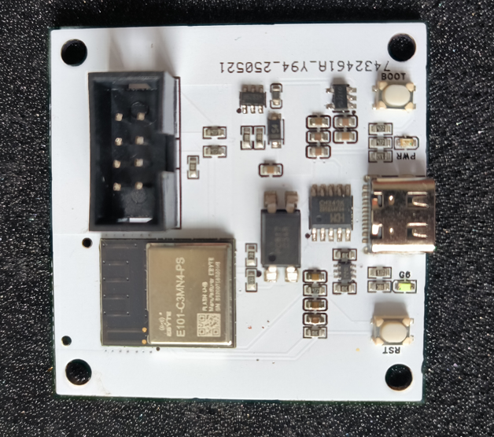

# 主控板使用文档
 

## RGB 指示灯
- 根据操作结果显示不同颜色，例如 `write` 操作写入失败显示红色，写入成功显示绿色。

## AP 指示灯
- AP 模式启动时常亮。

# Windows端读写工具

 - 通过串口连接主控板，使用 CH340X 串口芯片，需安装串口驱动，一般情况会静默自动安装（约 5 分钟），如未自动安装，请下载串口驱动。

## 安装步骤

1. 下载并安装客户端，按提示完成向导。
2. 如设备未识别串口，手动安装驱动后重新插拔主控板。

## 客户端下载

 - [https://www.spdrw.cn/download/windows/v1/1.0.1/SPDRW_1.0.1_x64-setup.exe](https://www.spdrw.cn/download/windows/v1/1.0.1/SPDRW_1.0.1_x64-setup.exe)

## 串口驱动下载

 - [https://www.spdrw.cn/download/windows/v1/CH341SER.ZIP](https://www.spdrw.cn/download/windows/v1/CH341SER.ZIP)

# Android端读写工具 使用文档
- 安卓端通过TYPE-C插上设备会自动启动APP并自动连接设备。

## 客户端下载
- [https://www.spdrw.cn/download/android/spdrw_1.0.0.apk](https://www.spdrw.cn/download/android/spdrw_1.0.0.apk)
