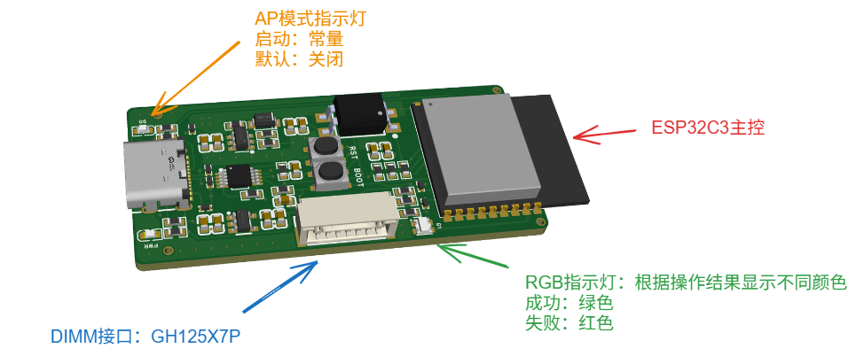

# 主控板 使用文档
 

## RST 和 BOOT 按键

 - RST：主控复位按键，按下松开主控复位，恢复初始状态
 - BOOT：功能键，连按两次启动AP模式，`WIFI`名称`SPDRW-WS`密码`123456789`。
 - 启动AP模式时同步启动WS服务端，可通过WS客户端(例如安卓端)连接`WS://192.168.5.1`。

## RGB指示灯

 - 根据操作结果显示不同颜色，例如`write`操作，写入失败会显示`红色`，写入成功显示`绿色`.

## AP指示灯

- AP模式启动时常量

